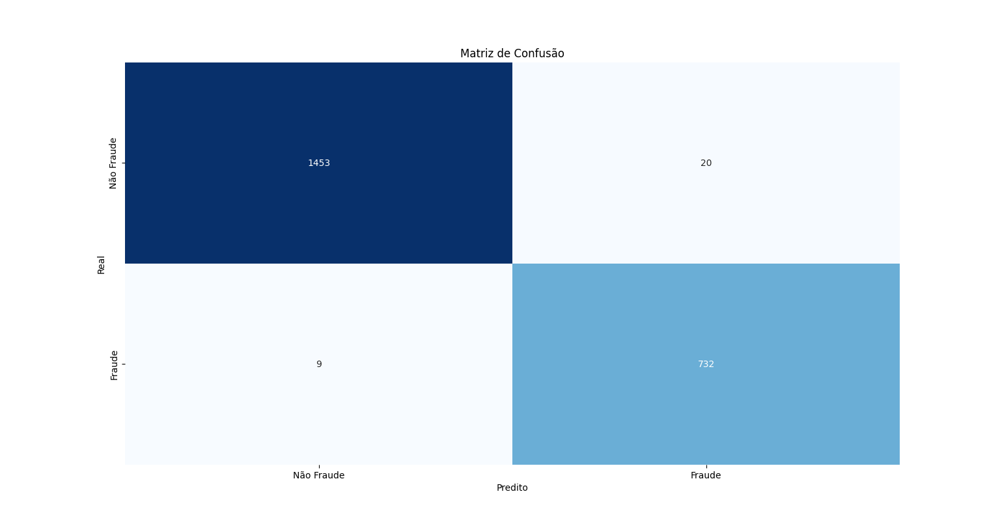

# Modelos de Classificação - Detecção de Fraude com XGBoost

Este repositório contém um modelo de classificação binária para detectar fraudes em transações de cartão de crédito, utilizando o algoritmo XGBoost. O modelo é treinado e avaliado em um conjunto de dados desbalanceado e conta com técnicas de balanceamento, como **RandomUnderSampler** e **SMOTE**, para melhorar a performance do modelo.

## Objetivo

O objetivo deste modelo é prever se uma transação é fraudulenta (classe `1`) ou não fraudulenta (classe `0`) com base em várias características de cada transação.

## Dataset

O dataset utilizado é o **`creditcard.csv`**, que contém informações sobre transações realizadas com cartão de crédito. O dataset é desbalanceado, com uma grande quantidade de transações não fraudulentas (classe `0`) em comparação com as transações fraudulentas (classe `1`).

### Principais Colunas:
- **V1, V2, ..., V28**: Variáveis numéricas extraídas a partir de características da transação.
- **Class**: Rótulo de classe, onde `0` indica uma transação não fraudulenta e `1` uma transação fraudulenta.

## Processamento e Balanceamento de Dados

1. **Balanceamento de Dados**: 
    - **Random Under-Sampling (RandomUnderSampler)**: A classe majoritária (não fraude) é reduzida para 10% do tamanho original da classe minoritária.
    - **SMOTE (Synthetic Minority Over-sampling Technique)**: A classe minoritária (fraude) é aumentada para 50% do tamanho da classe majoritária.

2. **Correlação**: Apenas as colunas mais correlacionadas com a classe `Class` são usadas para treinar o modelo. As 10 colunas mais correlacionadas com a classe alvo foram selecionadas.

3. **Divisão dos Dados**: O conjunto de dados foi dividido em **70%** para treinamento e **30%** para teste.

## Modelo

- **Algoritmo**: **XGBoost** (XGBClassifier), um modelo de árvore de decisão baseado em boosting.
- **Parâmetros**:
  - **objective='binary:logistic'**: Classificação binária.
  - **eval_metric='aucpr'**: Métrica de avaliação AUPRC (Área sob a curva de Precisão vs. Recall).
  - **learning_rate=0.03**: Taxa de aprendizado.
  - **max_depth=10**: Profundidade máxima das árvores.
  - **subsample=0.5**: Amostragem de 50% dos dados para evitar overfitting.
  - **colsample_bytree=0.8**: 80% das colunas são usadas em cada árvore.
  - **scale_pos_weight=10**: Dá mais peso à classe minoritária.

## Resultados

### AUPRC (Área sob a curva de Precisão vs. Recall):

- **AUPRC**: 0.9482

A métrica AUPRC é particularmente útil para modelos em dados desbalanceados, pois ela leva em consideração tanto a **precisão** quanto o **recall**. Quanto maior o valor, melhor o modelo.

### Métricas de Desempenho

**Precisão, Recall e F1-Score**:

| Classe | Precisão | Recall | F1-Score | Suporte |
|--------|----------|--------|----------|---------|
| 0      | 0.98     | 0.99   | 0.98     | 1473    |
| 1      | 0.97     | 0.96   | 0.97     | 741     |

 -------------------------------------------------
accuracy                            0.98      2214
--------------------------------------------------
macro avg       0.98      0.97      0.98      2214
--------------------------------------------------
weighted avg    0.98      0.98      0.98      2214
-------------------------------------------------

- **Accuracy**: 98%
- **Macro Avg**: Média das métricas para cada classe, sem considerar o tamanho da classe.
- **Weighted Avg**: Média ponderada das métricas, levando em consideração o número de amostras de cada classe.

 **Matriz de Confusão**:

Confusão:
 [[1453   20]
 [   9  732]]

## Visualização

A **Curva de Precisão vs. Recall** foi gerada para avaliar o desempenho do modelo. A curva mostra a relação entre precisão e recall para diferentes limiares de decisão. Quanto mais próxima a curva do canto superior direito, melhor o modelo.

### Curva de Precisão vs. Recall:

## Conclusão

- O modelo XGBoost, após balanceamento das classes, apresentou excelente desempenho na detecção de fraudes.
- A avaliação de desempenho através da AUPRC indica que o modelo tem uma boa capacidade de distinguir entre as classes, mesmo em um cenário de dados desbalanceados.

